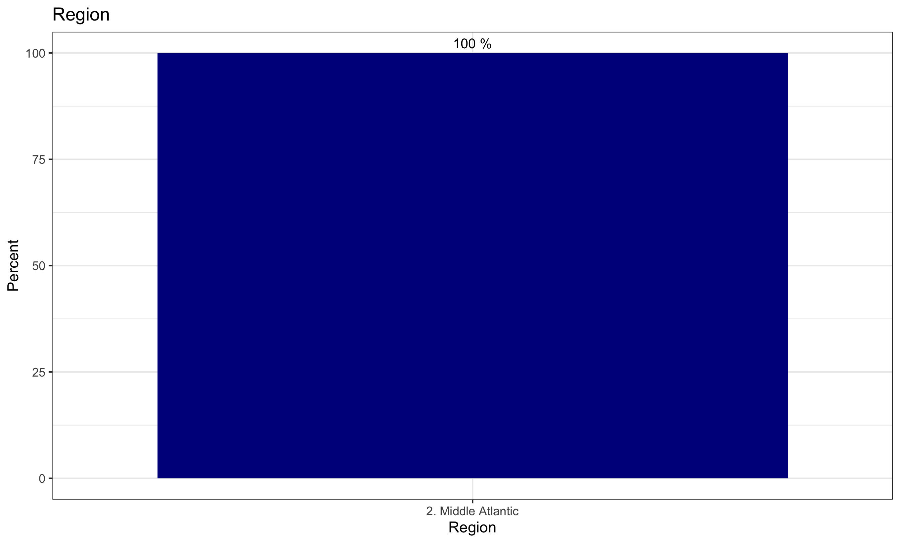
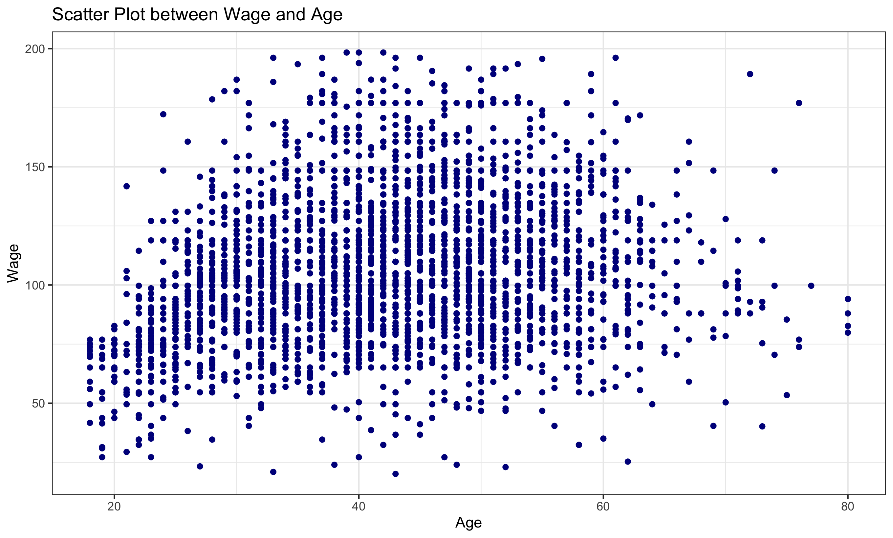
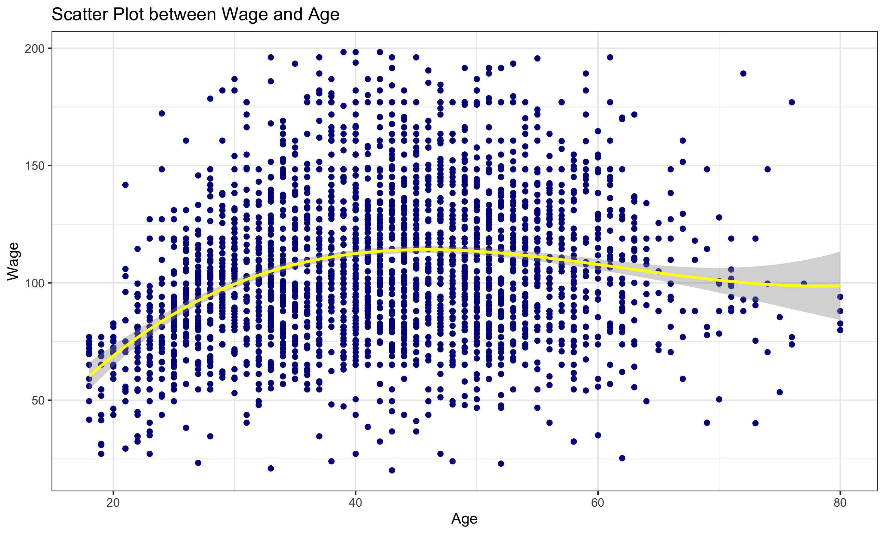
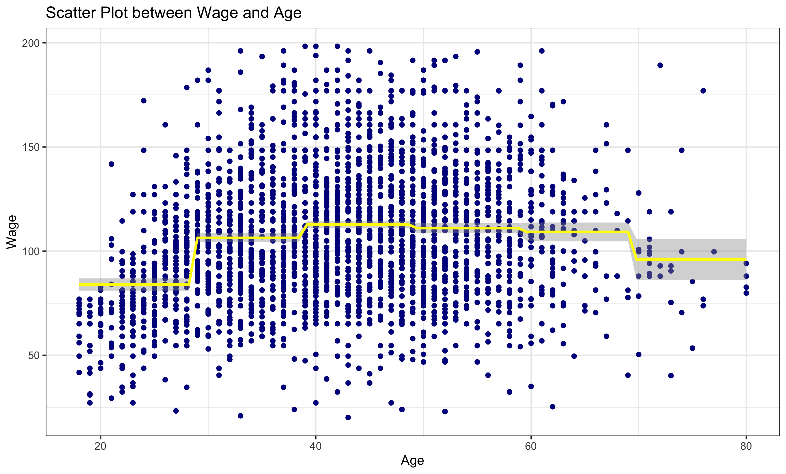
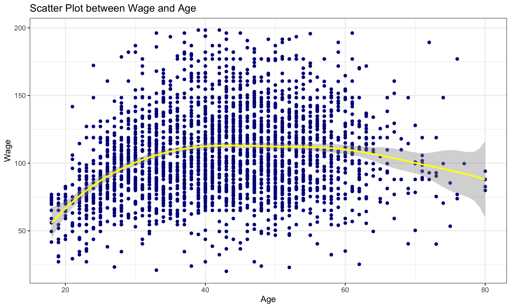

## Exploratory Data Analysis
This is the histogram for the response variable.  
  

Also, this is the bar plot for the Region, one of the predictor.  
  

#### Comment
 - Drop `region` out from teh analysis since the value for this variable is the same for the entire dataset.  
 - By considering the histogram of the wage, the response variable, I have eliminated the observations that wage > 200. (99 observations)  
- logwage has the same meaning with wage. I decided to drop it.  

## Model
-  Consider only age as a predictor.  Below is the scatterplot between wage and age.  
  

### First Model: Linear Regression
The $`R^2`$ is 0.04369, which is pretty low.  
  

### Second Model: Polynomial Regression
I used the polynomial degree 3, the $`R^2`$ is 0.111.  
  

### Third Model: Step Function
The $`R^2`$ for this model is 0.09057  
  

### Forth Model: Basis Spline
The $`R^2`$ for this model is 0.1125  
  

### Fifth Model: Natural Spline
The $`R^2`$ for this model is 0.1104  
  